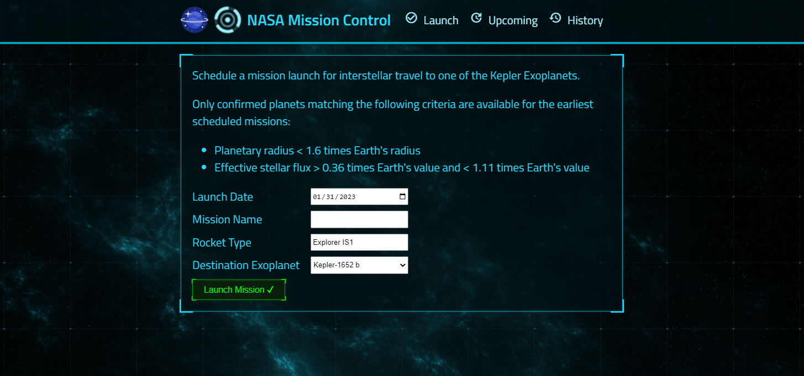
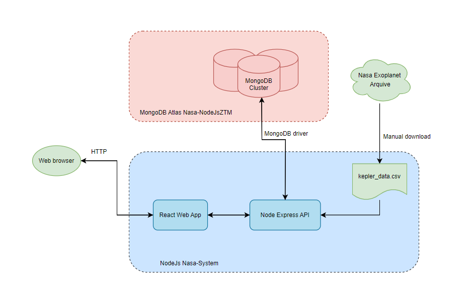

# NodeJs - Nasa Mission Control System


<div align="center">
  The mission control system schedules and abort launches to a given planet.
  <p></p>
  
</div>

## Preview

Click [here](http://ec2-52-91-149-236.compute-1.amazonaws.com:8000) to schedule your next space trip! 🚀

## Installation

1.  Clone the repository

```bash
git clone https://github.com/FranciscoGSilverio/NodeJsNasaSystem.git
```

2. Change your current directory to the project's root folder

```bash
cd NodeJsNasaSystem
```

3. Install the client and server dependencies

```bash
npm run install
```

Obs: You will need to create a .env file with your MongoDB connection string. It will look something like this: 

```bash
MONGODB_URL=<mysecretconnectionstring>
```

## Executing the Docker container

To avoid the configurations listed above you can execute using Docker

```bash
docker run -it -p 8000:8000 franciscogsilverio/ztm-nasa-project
```

## Architecture

The following diagram shows how each part of the program communicate between each other:

<div align='center'> 
  
</div>

## Contributing

Pull requests are welcome. For major changes, please open an issue first
to discuss what you would like to change.

Please make sure to update tests as appropriate.

## Made with

* JavaScript
* Node.js
* React.js
* Express.js
* MongoDB
* Jest

